# Concept Map: Black Hole Physics and Related Topics

```mermaid
graph TD
    %% Main Modules
    BHP[Black Hole Physics Module]
    SA[Stellar Astrophysics Module]
    PM[Physics Module]
    MM[Mathematics Module]
    
    %% Black Hole Physics Sections
    BHP1[Event Horizons and Singularities]
    BHP2[Simplified Mathematical Models]
    BHP3[Schwarzschild Solution]
    BHP4[Rotating Black Holes]
    BHP5[Black Hole Thermodynamics]
    BHP6[Accretion Disks and Jets]
    BHP7[Recent Discoveries]
    BHP8[Common Misconceptions]
    BHP9[Information Paradox]
    
    %% Stellar Astrophysics Sections
    SA1[Stellar Formation]
    SA2[Stellar Structure]
    SA3[Stellar Evolution]
    SA9[Stellar Endpoints]
    
    %% Physics Sections
    PM2[Classical Mechanics]
    PM5[Oscillations and Waves]
    PM7[Electromagnetism]
    PM9[Modern Physics]
    
    %% Mathematics Sections
    MM1[Calculus]
    MM2[Differential Equations]
    MM3[Linear Algebra]
    
    %% Interactive Elements
    INT1[Schwarzschild Visualization]
    INT2[Kerr Visualization]
    INT3[Hawking Radiation Simulator]
    
    %% Module Connections
    BHP --> BHP1 & BHP2 & BHP3 & BHP4 & BHP5 & BHP6 & BHP7 & BHP8 & BHP9
    SA --> SA1 & SA2 & SA3 & SA9
    PM --> PM2 & PM5 & PM7 & PM9
    MM --> MM1 & MM2 & MM3
    
    %% Cross-Module Connections
    SA3 -->|Massive Star Evolution| BHP1
    SA9 -->|Black Holes as Stellar Endpoints| BHP1
    
    PM2 -->|Gravitational Forces| BHP2
    PM2 -->|Orbital Dynamics| BHP3
    PM5 -->|Wave Properties| BHP7
    PM7 -->|Electromagnetic Fields| BHP6
    PM9 -->|Special Relativity| BHP3
    PM9 -->|General Relativity| BHP3 & BHP4
    PM9 -->|Quantum Mechanics| BHP5 & BHP9
    
    MM1 -->|Calculus Concepts| BHP2
    MM2 -->|Differential Equations| BHP3 & BHP4
    MM3 -->|Tensors and Matrices| BHP3 & BHP4
    
    %% Interactive Connections
    BHP3 --> INT1
    BHP4 --> INT2
    BHP5 --> INT3
    
    %% Key Concepts
    KC1[Event Horizon]
    KC2[Singularity]
    KC3[Spacetime Curvature]
    KC4[Frame Dragging]
    KC5[Hawking Radiation]
    KC6[Gravitational Waves]
    
    BHP1 --> KC1 & KC2
    BHP3 & BHP4 --> KC3
    BHP4 --> KC4
    BHP5 --> KC5
    BHP7 --> KC6
    
    %% Styling
    classDef module fill:#f9f,stroke:#333,stroke-width:2px;
    classDef section fill:#ddf,stroke:#333,stroke-width:1px;
    classDef interactive fill:#dfd,stroke:#333,stroke-width:1px;
    classDef concept fill:#fdd,stroke:#333,stroke-width:1px;
    
    class BHP,SA,PM,MM module;
    class BHP1,BHP2,BHP3,BHP4,BHP5,BHP6,BHP7,BHP8,BHP9,SA1,SA2,SA3,SA9,PM2,PM5,PM7,PM9,MM1,MM2,MM3 section;
    class INT1,INT2,INT3 interactive;
    class KC1,KC2,KC3,KC4,KC5,KC6 concept;
```

This concept map illustrates the relationships between the Black Hole Physics Module and other modules in the course, showing how concepts interconnect across different areas of study. The map highlights:

1. The structure of the Black Hole Physics Module and its nine sections
2. Connections to relevant sections in the Stellar Astrophysics Module
3. Dependencies on fundamental concepts from the Physics Module
4. Mathematical foundations required from the Mathematics Module
5. Interactive elements that support learning key concepts
6. Core concepts that span multiple sections and modules

Use this map to navigate the interconnected nature of black hole physics and to understand how concepts from different disciplines come together in the study of these fascinating cosmic objects.
